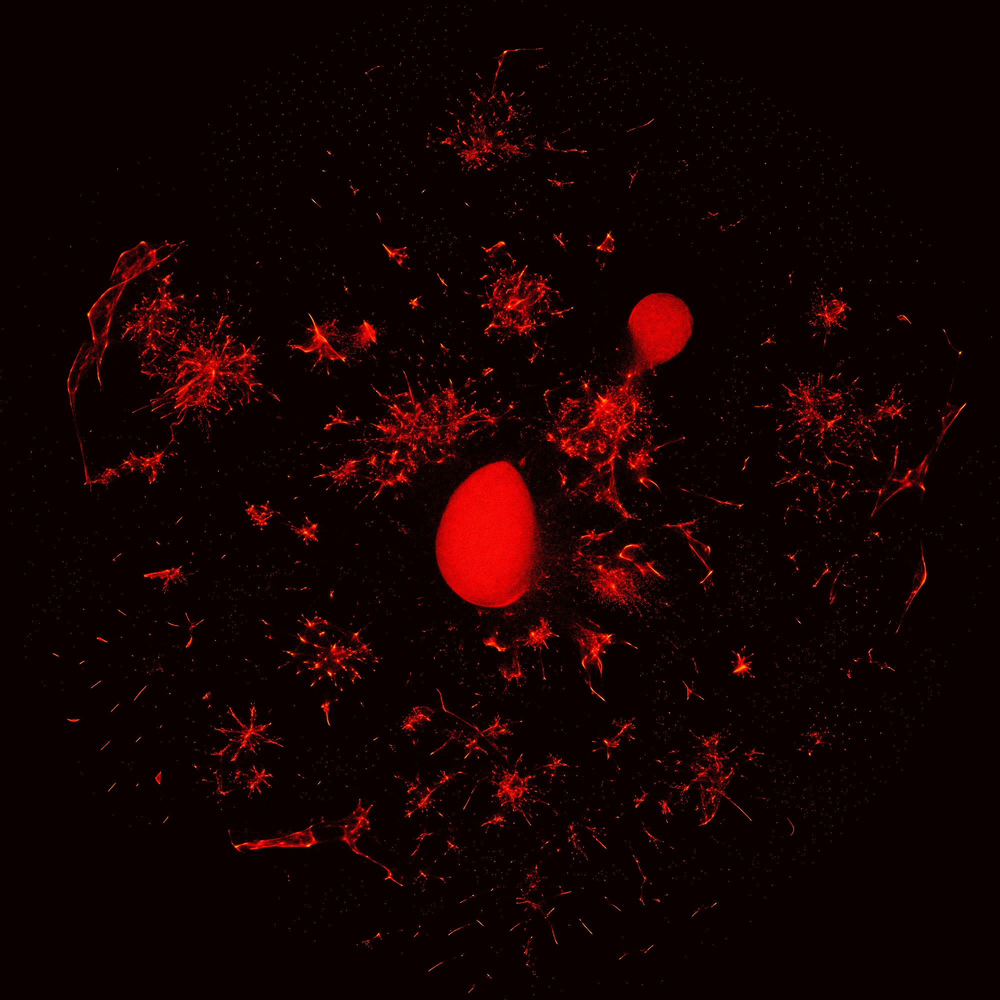

# Relational Data Embeddings for Feature Enrichment with Background Information

For many machine-learning tasks, **augmenting the data at hand with features built from external sources is key to improving performance**. For instance, estimating housing prices benefits from background information on the location, such as the population density or the average income. However, this information must often be assembled across many tables, requiring time and expertise from the data scientist.

Instead, we propose to replace human-crafted features by **vectorial representations of entities** (*e.g.* cities) that capture the corresponding information. We represent the relational data on the entities as a **graph** and adapt
graph-embedding methods to create feature vectors for each entity. We show that two technical ingredients are crucial: modeling well the different **relationships** between entities, and capturing **numerical** attributes. For this, we leverage **knowledge graph embedding** methods. Although they were primarily designed for graph completion purposes, we show that they can serve as powerful feature extractors. However, they only model discrete entities, while creating good feature vectors from relational data also requires capturing numerical attributes. We thus introduce **KEN** (**K**nowledge **E**mbedding with **N**umbers), a module that extends knowledge graph embedding models to numerical values.

*Our proposed embedding pipeline for feature enrichment.*

We thoroughly evaluate approaches to enrich features with background information on 7 prediction tasks. We show that a good embedding model coupled with KEN can perform better than manually handcrafted features, while requiring **much less human effort**. It is also competitive with combinatorial feature engineering methods, but is much more **scalable**. Our approach can be applied to huge databases, creating **general-purpose feature vectors reusable in various downstream tasks**.

# Enriching your data with Wikipedia

We describe in this section how to enrich your data with information from Wikipedia. For this, we leverage [YAGO3](https://yago-knowledge.org/downloads/yago-3), a large knowledge base derived from Wikipedia, and apply our embedding pipeline to generate vectors for many entities. These pretrained embeddings are readily available in parquet files that you can download [here](#downloading-entity-embeddings).

### Description of YAGO3 and embedding approach
YAGO3 is a large knowledge base derived from Wikipedia in multiple languages and other sources.
It represents information about various entities (people, cities, companies...) in the form of a knowledge graph, *i.e.* a set of triples *(head, relation, tail)*, such as *(Paris, locatedIn, France)*.
Overall, our version of YAGO3 contains **2.8 million** entities, described by **7.2 million** triples (including 1.6 million with numerical values, such as city populations or GPS coordinates).

We learn 200-dimensional vectors for these entities, using as knowledge-graph embedding model MuRE (Balažević *et al.*, [2019](https://arxiv.org/abs/1905.09791)), which we combine with KEN to leverage numerical attributes.

### Visualizing entity embeddings

We show below 2D visualizations of the resulting embeddings, using [UMAP](https://umap-learn.readthedocs.io/en/latest/) to reduce their dimension from 200 to 2. We first plot the density of entities in the 2D embedding space, which reveals many clusters of various sizes. We then investigate further these clusters, and show how they correspond to entities of different types.

*2D visualization of entity embeddings learned from YAGO3 (brighter zones correspond to higher entity densities).*

*2D visualization of entity embeddings learned from YAGO3, colored by their types.*

### Downloading entity embeddings

We provide here links to download embeddings for entities of various types: [administrative districts](assets/data/emb_administrative_district.parquet), [people](assets/data/emb_person.parquet), [artists](assets/data/emb_artist.parquet), [albums](assets/data/emb_album.parquet), [movies](assets/data/emb_movie.parquet), [companies](assets/data/emb_company.parquet).

